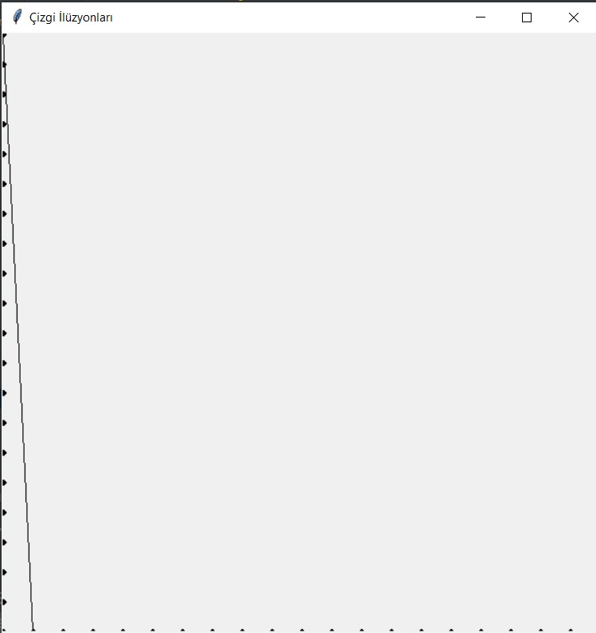
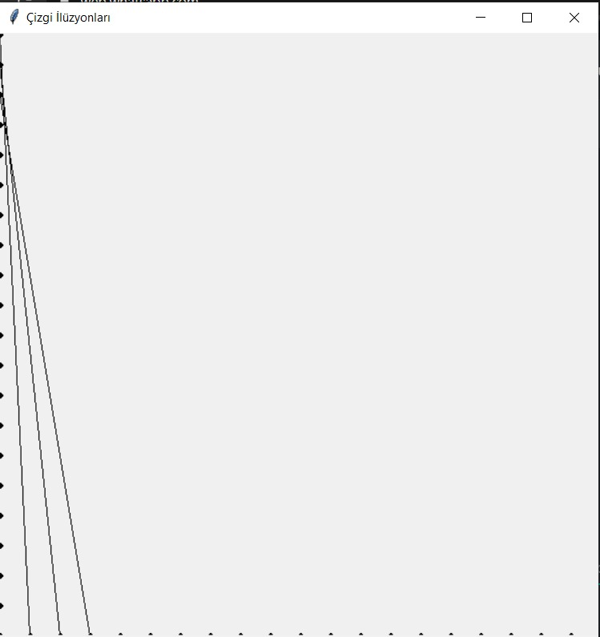
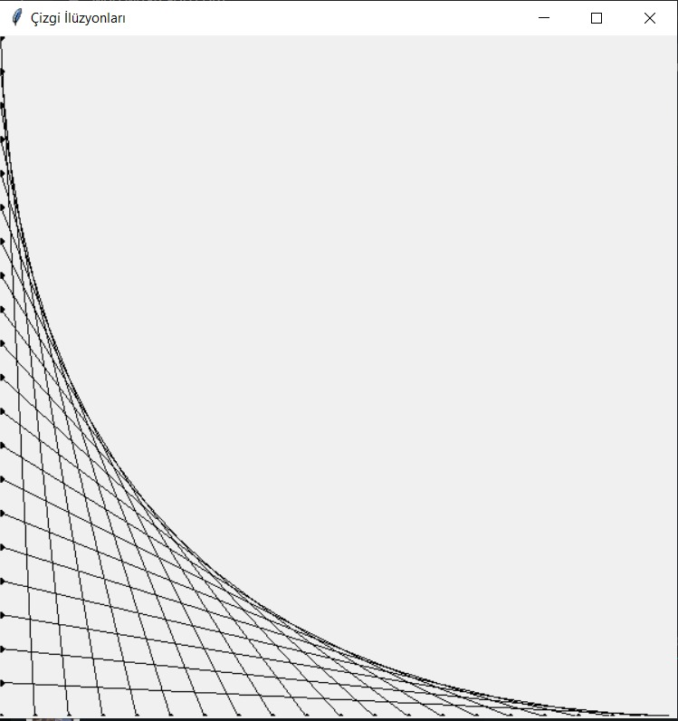

## Başlangıç Kodları

[Buraya tıklayarak](https://drive.google.com/file/d/1F8gfLECYaDmYFm_1bgmZ9WgpA7SM3fJ6/view?usp=sharing) bu haftaya ait çalışmaların başlangıç kodlarına ve oyundaki araba resimlerine ulaşabilirsiniz.

## Egzersiz 1 - Araba Oyuna Devam 
Geçen hafta araba oyunumuzu yazmaya başlamıştık. Geçen hafta bahsettiğimiz adımları tekrar hatırlayalım:
1. Ekrana bir yazı (text) ekleyerek kullanıcıya fareyle ekrana tıkladığında oyunu başlatabileceğini bildirmek.
2. Kanvasımızın üzerine yolun şeritlerini çizdirmek.
3. Yeşil ve mavi araçların kanvas üzerindeki pozisyonlarını verilen sabitleri kullanarak belirlemek ve basit dikdörtgenler olarak yoldaki şeritlere eklemek.
4. Araçları sürekli aşağı doğru hareket ettirmek.
5. Ekrandan çıkan araçların tekrar başlangıç pozisyonlarından rastgele yeni bir hızla hareket etmesini sağlamak. Burada aracın ekrandan dışarı çıktığını grafik ütüphanesi fonksiyonları kullanarak nasıl anlayacağımızı iyi düşünmeliyiz. 

Bu hafta, geçtiğimiz grup çalışmasında yaptıklarımızı programımızda çalıştıracağız ve oyunumuzu ekranımızda göreceğiz. Bunun için 4. adımdan devam etmemiz gerek.

**İpucu**: Bir parça kodun sürekli olarak çalışması için bir şeylerin hep *doğru* olması gerekir.

```
while True:

    kanvas.update()                 # Kanvası yeniler, özellikle kanvasta yaptığımız değişiklikler bu fonksiyon olmadan ekrana yansımaz
    time.sleep(bekleme_suresi)      # programı bekletir
```

 Bu haftaki hedeflerimiz bittiğinde oyunumuzun nasıl görüneceğini aşağıdaki videodan izleyebilirsiniz:
<iframe src="https://drive.google.com/file/d/14-YbEiv2qRbv0HwvfLZovXMkT_bUxMds/preview" width="640" height="480" allowfullscreen="true" mozallowfullscreen="true" webkitallowfullscreen="true"></iframe>
[Buraya tıklayarak](https://drive.google.com/file/d/1Z0V48Gl_6YYi195LPJJorN54yS1gZmwn/view?usp=sharing) derste gördüğünüz oyunun tamamlandığında nasıl görüneceğini izleyebilirsiniz.

## Egzersiz 2
Bu egzersizde sizden CS 101 Evreni Grafik kütüphanesi kullanarak canlandırmanızı bekliyoruz. CS 101 Gezegeninde iki tür cisim yer almaktadır:
- **Güneş**-*programlama*: Yarı çapı kodda `GUNES_YARI_CAP` olarak belirtilmiş bir oval ile temsil edilir. Güneş kanvası tam ortalamalıdır.
- **Yıldızlar**-*CS 101 Topluluğu*: Yıldızlar farklı boyutlarda ve kanvasın farklı köşelerinde oval olarak belirirler, aynı CS 101 öğrenci ve eğitmenlerinin farklı yerlerden programlama yaptığı gibi.

## Birinci Aşama - Şekilleri oluşturmak
İlk olarak kanvasa Güneş'i ve yıldızlar ekleyin. Dikkat etmeniz gerekenler: 

- **Güneş** yarı çapı kodda `GUNES_YARI_CAP` olarak belirtilmiş bir oval ile temsil edilir. Güneş kanvası tam ortalamalıdır.
- **Yıldızlar** farklı boyutlarda ve kanvasın farklı köşelerinde oval olarak belirirler. Yıldızları oluştururken dikkat etmeniz gerekenler:
    - Oluşturulması gereken yıldız sayısı kodda `TOPLAM_YILDIZ_SAYISI` sabiti ile belirtilmiştir. 
    - Yıldızların enini de boyunu da rastgele belirlemelisiniz. Olabilecek en küçük yıldız boyutu `YILDIZ_MIN_BOYUT`, en büyük yıldız boyutu da `YILDIZ_MAX_BOYUT` ile kodda belirtilmiştir.
    - Yıldızların rengini rastgele seçmek için başlangıç kodunda verilen `rastgele_renk_sec` fonksiyonunu kullanabilirsiniz.

## İkinci Aşama - Yıldızları Hareketlendirmek

Evrenimizi yarattıktan sonra kullanıcıdan gelecek fare tıklaması ile yıldızlarımızı hareketlendirelim. Yıldızlar sürekli olarak rastgele süratlerde hareket etmeli. Birinci aşamada oluşturduğunuz yıldızlar `YENILEME_SURESI` kadar saniyede bir `x`ve `y` yönündeki hızlarını değiştirir. Yıldızların hızı kodda belirtilen `MIN_HIZ` ve `MAX_HIZ` aralığında kalmalıdır.

**İpucu**: Yıldızlarınızın hızını değiştirebilmek için birinci aşamada oluşturduğunuz yıldızları bir *list*'te tutabilirsiniz.

Evrenimizin nasıl gözükeceğini aşağıdaki örnek videoda görebilirsiniz:
<iframe src="https://drive.google.com/file/d/1F8SnuDIj94kL1t4iZwO8XBQIg83TBbce/preview" width="640" height="480"></iframe>


## Ekstra Egzersizler

### Egzersiz 1
Bilgisayar mühendisliği yöntemleri günümüzde nispeten yeni bir sanat dalı olan dijital sanatlarda sıkça kullanılmaktadır. Gelin birçok çizgi kullanarak bir eğri deseni çizen bir dijital sanat kodu yazalım! Desenimiz şu şekilde:
**İpucu**: Kanvasımızın iki kenarına eşit aralıklarla (`CIZGILER_ARASI_BOSLUK`) noktalar yerleştirdiğimizi ve bu noktalarımızı birleştirdiğimizi hayal edin. 

<table>
<tr>
        <th>
                
        </th>
        <th>
                
        </th>
        </tr>
        <tr>
        <th>
                
        </th>
        </tr>
        </table>


### Egzersiz 2
Aslında bu egzersiz ekstra egzersiz ikinin üzerine ekleyeceğimiz bir egzersiz. Sizden bir sanat projesi için yukarıda oluşturduğunuz çizgilerden lazer şovu hazırlamanız bekleniyor. Çizgilerin rengi sıra ile rastgele başka bir renge dönüşmeli. Aşağıda bir örneğini görebilirsiniz.  
**Önemli Not**: Eğer göz hassasiyetiniz ya da epilepsi hassasiyetiniz varsa videoya çok uzun süre bakmamanızı öneriyoruz.

<iframe src="https://drive.google.com/file/d/1F62stY5BN7_CmUB5U-suGDR4DeSu645A/preview" width="640" height="480"></iframe>