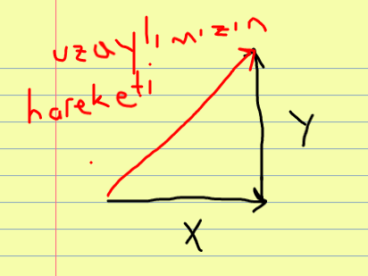
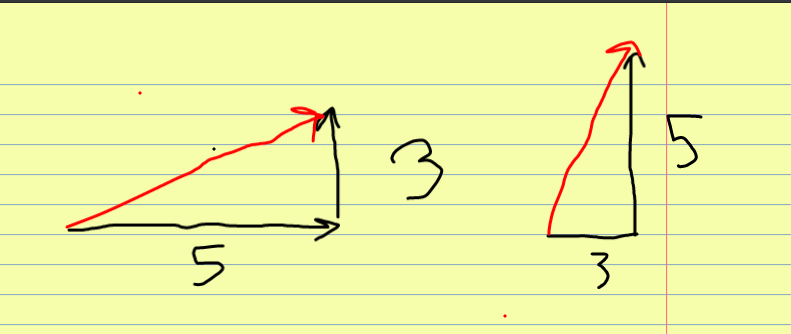
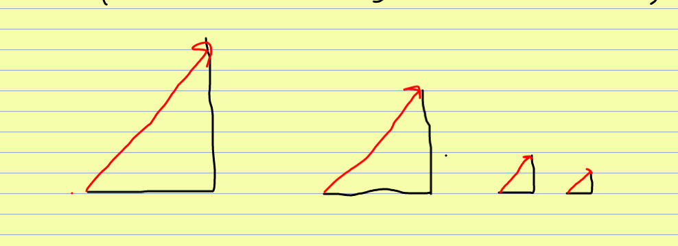
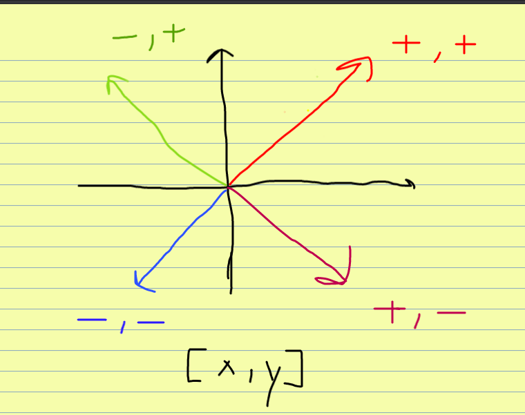
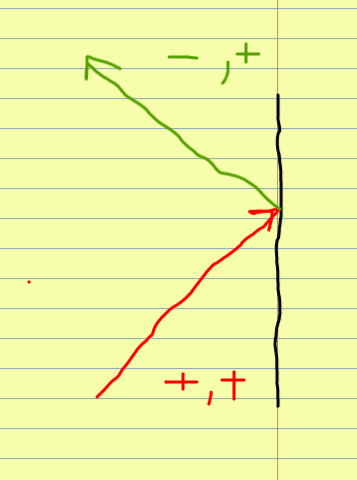
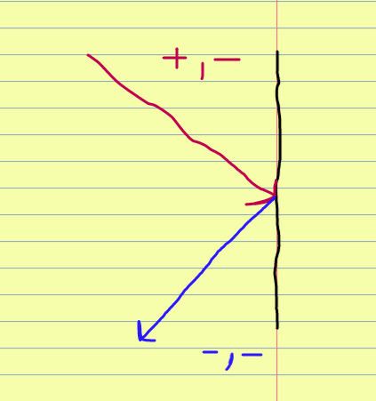
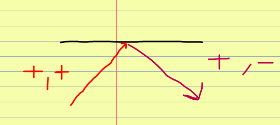
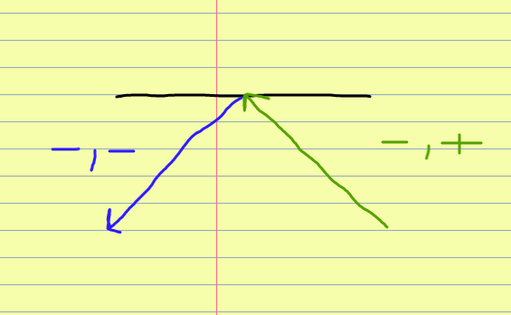

##Uzaylıları oluştururken problem yaşıyorum ne yapmalıyım?
(Buraya halihazırda handoutlarda söylediklerimizden 
farklı ne söylenebilir bilemedim.)

##Uzaylılarımın hepsi aynı yönde hareket ediyor 
ne yapmalıyım?

-Bu problemle karşılaşmanızın sebebi genellikle
hız listesi oluştururken her uzaylı başına bir adet 
hız değeri oluşturulmasıdır. Move fonksiyonu `kanvas.move()` fonksiyonu 3 argüman alır: 
hareket ettireceğimiz obje, x yönündeki hız değeri, y yönündeki hız değeriAncak iki boyutlu bir alanda
çalıştığımız için her vektörün farklı yöne bakabilmesi 
için hem x düzlemi hem de y düzlemi için iki farklı değer 
oluşturmalıyız. Matematikte dikliği nasıl hesapladığımızı
hatırlayalım, önemli olan x ve y değerlerinin birbirlerine
olan orantısı.

Eğer uzaylılarımızın hareketindeki 
x ve y değeri eşit olursa,
birbirlerine olan oranları hep 1 olacaktır ve uzaylılarımızın 
hepsi aynı şekilde yol alıcaktır.

Bu nedenle hız listesi yapımız şu şekilde olmalıdır:

[[hiz0_x, hiz0_y], [hiz1_x, hiz1_y], ..., [hizn_x, hizn_y]]

Aynı zamanda uzaylılarımızın rastgele hareketinin 
360 derece yani her yöne olmasına istiyorsak, hız listemizi
oluştururken MIN hız değerini negatif bir sayı yapabiliriz.

##Uzaylıları oluşturdum, hız_listesi oluşturdum ancak onları nasıl hareket ettirebilirim?

-Öncelikle uzaylıları oluştururken onları bir listeye eklediğimizden emin olalım.
Yoksa sonrasında dönüp oluşturduğumuz uzaylıya ulaşmakta zorlanırız.
Hız listemiz ile uzaylı_listemiz aynı uzunlukta olmalı ki böylece
her uzaylı başına düşen bir hızımız var. Bu durumda bir for döngüsü kullanarak amacımıza ulaşabiliriz.

##Uzaylıları nasıl duvardan sektireceğim?

-Uzaylıların hareketlerini x ve y'nin birleşimi ile oluşan
bir ok gibi düşünmenin faydalı olucağını yukarda konuşmuştuk.
Şimdi düşünmemiz gereken şey bu uzaylıların duvara çarptıklarında 
x ve y değerlerinde nasıl bir değişim gerçekleşeceği. Aşağıdaki 
görseller size yardımcı olabilir:

Bir objeniin kordinatlarına 'get_left_x' ve 'get_top_y()' ve fonksiyonları ile 
ulaşabildiğimizi unutmayalım, bu durumda tek yapmamız gereken 
uzaylılarımızın kanvasın sınırlarını değip değmediklerine bakmak 
ve şayet deydilerse değen uzaylının hız değerlerini hız listesinde 
değiştirmek.

***
##SIK YAPILAN HATALAR
 
Tek sefer çalıştırılması gereken şeyleri de 
döngüsünün içine koyuyor olmak.

(baska ne eklenebilir?)

