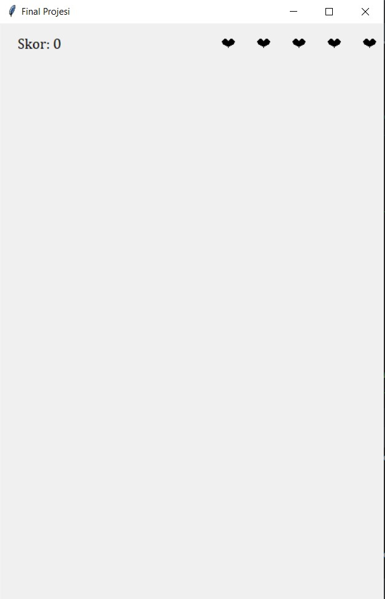
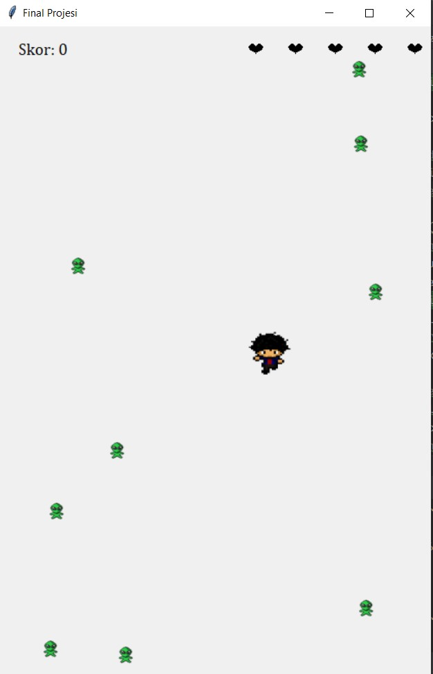

CS 101 Bahar 2021'in 5 haftasını geride bıraktık! Şimdiye kadar inanılmaz bir gelişme gösterdiğiniz ve 
programı takip ettiğiniz için hepinizi tebrik ederiz. Programın son 3 haftasında Final Projesi yaparak 
öğrendiklerinizi bir oyunla ölümsüzleştireceksiniz. 

Aşağıda Final Projesi ile ilgili verilen uzuun açıklamayı dikkatlice okuyun, başarılar.

## Başlangıç Kodları
Final Projesine ait başlangıç kodlarına [buradan](https://drive.google.com/u/0/uc?id=1SZz0dsrVpGlmB4zrQ2RI8rrgTe6lLhjz&export=download) ulaşabilirsiniz.

## Lojistik Hatırlatmalar
Final Projesi programı bitirme oranınızda önemli bir yere sahiptir.
Projede size verilen başlangıç kodlarında belli değişkenler ve fonksiyon önerileri tanımlanmıştır, bunları kullanabileceğiniz 
gibi kendi fonksiyonlarınızı da yazabilirsiniz.

Final Projesi 2 ana aşamaya ayrılmıştır, bu aşamaların açıklamalarını aşağıda bulabilirsiniz.   
<span>1.</span> Aşamanın teslim tarihi **7 Nisan Çarşamba**,   
<span>2.</span> Aşamanın teslim tarihi: **18 Nisan Pazar** olarak belirlenmiştir.  
Bonus ile belirtilen görevler zorunlu değildir, sadece oyununuzu geliştirebilecek önerilerdir. Yaratıcılığınızı
kullanıp ek özellikler ekleyebilirsiniz, hatta bunları Ed'den hepimizle paylaşın!

### Aşamalar
#### 1. Aşama
- Oyun Arka Planı
    - Skor yazısı
    - Can yazısı
    - Uzaylıları oluştur
    - Uzaylılar hız listesi oluştur
    - Ana karakteri oluştur
- Oyun Döngüsü
    - Uzaylıları rastgele hareket ettir
#### 2. Aşama
- Uzaylıların ekrandan çıkmasını kontrol et
- Ana karakteri mouse ile hareket ettir
- Çarpışmaları kontrol et
    - Canları güncelle
- Skoru güncelle
- Bitiş ekranı
    - Kaybettiniz veya Kazandınız şeklinde sonucu görüntüle

Dokümantasyonun uzun olmasından korkmayın &#128519; bu sayfada final projesini yazarken
ihtiyaç duyabileceğiniz bütün bilgileri kapsamaya ve görevlerinizi elimizden 
geldiğince detaylı açıklamaya çalıştık.

Her ödevimizde olduğu gibi Final Projesinde de arkadaşlarınızla sözlü olarak fikir alışverişinde
bulunabilirsiniz. Ancak akademik dürüstlük ilkelerini doğrultusunda kod değiş tokuşu yasaktır ve ödevinizin geçersiz sayılmasına neden olabilir. Tüm sorularınızı [Ed](https://edstem.org/us/courses/4754/lessons/)
sayfamızdan eğitmenlerinize sorabilirsiniz.

Başarılar &#128640;!
### Ön Hazırlık
Grafik kütüphanemizi kullanarak resim eklemek ya da resimler üzerinde değişiklik yapmak 
için Pillow isimli ek bir paket indirmemiz gerek. Pillow'u indirmek için bir terminal 
penceresi açın (PyCharm'ın içindeki Terminal sekmesini kullanabilirsiniz) ve aşağıdaki 
komutu girin:  
Windows için:
```bash
python -m pip install Pillow==7.1.1
``` 
Mac için:
```bash
python3 -m pip install Pillow==7.1.1
```

Kurulum başarı ile tamamlandığında terminalinizde son olarak "Successfully installed Pillow-7.1.1" ibaresi görünür. Artık grafik kütüphanemizdeki resim içeren fonksiyonları kullanabiliriz!

## Hikaye
Ahmet küçüklüğünden beri uzaya hep ilgi duymuştur. Boş zamanlarında 
gezegenler hakkında kitaplar okur ve yıldızları izlemekten çok zevk alır. 
Galaksinin uçsuz bucaksız büyüklüğünü düşünürsek, insanlık bu koca evrende 
nasıl yalnız olabilirdi ki? Bir gün teleskobundan uzayı incelerken, 
Ahmet bir Ufo’nun yakınlarındaki tarlaya düştüğünü görür. Ahmet hızlıca montunu 
giyerek tarlaya doğru koşmaya başlar...

## 1. Aşama
Ufosu düşmüş olan uzaylılar Ahmet’in yaklaşmakta oldugunu gorur. Uzaylılar
 Ahmet’i karşılamak için  geleneksel 'Selamlaşma Dansını' yapmak 
 isterler. Bu dans sırasında her uzaylı farklı yönlerde koşuşturarak 
 duvarlardan sekmektedir. Grafik kütüphanesini kullanarak Uzaylıların Ahmet 
 gelmeden danslarını prova etmelerine yardımcı olun:
 ### 1.A Haritanın Ayarlanması
 1. Uzaylıların pratik yapabilmesi için bir `Canvas` oluşturun. 
    - Kanvasın boyutları  başlangıç kodunda `KANVAS_EN` ve `KANVAS_BOY` değişkenleriyle verilmiştir.
    - Kanvasın başlığını "Final Projesi" olarak ayarlayın.
 2. Projenin 2. aşamasında oyunumuza Can ve Skor ekleyeceğimiz için kanvasta Ahmet'in
 kalan canlarını ve skorunu gösterebileceğimiz iki yazı (text) oluşturun:   
    - Ahmet'in oyuna başlarken sahip olduğu toplam can sayısı kodda `TOPLAM_CANLAR` değişkeniyle belirtilmiştir.
    - Canları sayı ile gösterebileceğiniz gibi `"\u2764\ufe0f"` string'inin tekrarı ile de gösterebilirsiniz.      
    - Koordinatları ayarlama:
        - Skor ve Can gösteren yazıların y koordinatı kodda `YAZILAR_Y_KOORDINATI` değişkeniyle belirtilmiştir.
        - Skor yazısının merkezi yatay hizada (x ekseninde) `YAZILAR_X_AYRIMI`'na denk gelmektedir.
        - Can yazısının merkezi ise yatay hizada kanvasın sağından `YAZILAR_X_AYRIMI` kadar içeridedir.
    - Skor ve Can gösteren yazıların fontunu `FONT` ve `FONT_BUYUKLUGU` ile belirtilen fonta ayarlayın.

**Not:** Pythonda stringlerin içerisinde Türkçe karakterleri kullanabildiğimiz gibi tüm dünya dillerinin karakterlerini, hatta emojileri bile kullanabilirsiniz. Tüm emojilerin listesine [buradan](https://unicode.org/emoji/charts/emoji-list.html) ulaşabilirsin.

```python
>>> print("\u2764\ufe0f")
❤️
```
    
 <span>1.</span> ve 2. aşamaların sonunda kanvasınız aşağıdakine benzer gözükmelidir:
{ width=100px }

 
 ### 1.B Uzaylıların Oluşturulması
 Haritanız hazır olduğuna göre uzaylıları kanvasa ekleyebilirsiniz. 
 1. Uzaylıları kanvasa resim olarak ekleyeceksiniz. Uzaylıların boyutu `UZAYLI_BOYUT` x `UZAYLI_BOYUT` olmalıdır.  
 2. Çok düzenli bir ailede yetişen uzaylılar danslarına başlamadan önce 
 kanvasın sol üst köşesinde `YAZILAR_Y_ARIMI`, 2 x `YAZILAR_Y_AYRIMI` koordinatlarından
 başlayarak dizilirler. Uzaylıları her satırda `UZAYLI_SUTUN_SAYISI` kadar uzaylı yerleşecek 
 şekilde `UZAYLI_SATIR_SAYISI` kadar satıra yerleştirin. Uzaylıları eklemek için `uzaylilari_olustur(kanvas, sutun_sayisi, satir_sayisi, uzayli_resmi)`
 fonksiyonunu yazın. Burada `uzayli_resmi` uzaylı resminin adresini içeren string'dir. Kolaylık olması açısından bu adresler
 kodun başında sabit olarak tanımlanmıştır.  
 **İpucu 1:** Uzaylıları yerleştirirken 4. haftada yaptığımız _Satranç Tahtası_ örneğini hatırlayın.  
 **İpucu 2:** Uzaylıları bir listede tutun.      
 **Not:** Final projesinde kullacağınız bütün resimleri  başlangıç kodlarında `resimler` klasöründe bulabilirsiniz. Dilerseniz, bu resimleri kendi projeniz için 
 başka resimlerle değiştirebilirsiniz. Ancak resimleri değiştirmeye karar verirseniz bu resimleri
 `resimler` klasörüne ekleyip Ed üzerinden teslim ettiğiniz ödevde de yer almasına dikkat edin.
 3. Her uzaylı için hız belirleyin. Uzaylıların hızlarını oluşturmak için `uzaylilar_hiz_listesi_olustur(n)`
 fonksiyonunu yazın, burada `n` toplam uzaylı sayısını temsil eder.
    - Her uzaylı ekrana eklendiğinde veya sonrasında `UZAYLI_MIN_HIZ` ila `UZAYLI_MAX_HIZ` arasında rastgele bir
    hız değeri oluşturun. Unutmayın, uzaylılar hem x hem de y ekseninde hareket edebilir.  
  **İpucu 1:** Uzaylıların hızlarını atarken 5. haftada yaptığımız _Yağmur Damlaları_ örneğini hatırlayın.      
  **İpucu 2:** `random.randint()` fonksiyonu ile rastgele bir tamsayı elde edebilirsiniz.
  
 ### 1.C Ana Karakterin Oluşturulması
Uzaylılar ekrandaki yerlerini aldığına göre ekrana ana karakteri ekleyebilirsin. Ana karakteriniz oyuna kanvasın tam ortasında başlamalıdır. Boyutları `ANA_KARAKTER_BOYUT` ile verilmiştir.

Ana karakter ve uzaylılar da eklendiğinde kanvasınız aşağıdaki gibi gözükebilir:
{ width=100px }

### 1.D Uzaylıların Hareketi
Görsel olarak kanvasınızı hazırladığınıza göre animasyonu kurmaya başlayabilirsiniz. 
1. Öncelikle, her uzaylı [1.B](#1b-uzaylıların-oluşturulması)'de belirlediğiniz hızda hareket etmelidir.
2. Uzaylıların duvarlardan sekmesini sağlayın. 
    - Kanvasın dışına çıkan uzaylıların hızını güncelleyin. Örneğin, uzaylınız sağ 
    duvara çarptıysa hızının hangi eksenini değiştirmemiz gerekir?
    - Bunu yaparken 5. Derste çözdüğümüz _Zıplayan Top_ örneğini
tekrar etmek ve aşağıdan sekme durumunu sol, üst ve sağ duvarlara nasıl 
uygulayacağınızı düşünmek faydalı olacaktır. 
    - Unutmayın, bir objenin kanvasın dışına
çıkması aslında sadece bulunduğu koordinatların kanvasın dışında kalmasıdır.

<span>1.</span> Aşamanın sonunda oyununuz şu şekilde gözükebilir:
{ width=100px }

## 2. Aşama
### 2.A Ana Karakterin Hareketi
Ufo alanına ulaşan Ahmet uzaylıları dans ederken görünce, heyecanından donakalır.
 Ahmet’in mouse ile hareket edebilmesi için ona yardımcı olun. 

- Başlangıç kodlarında verilen `ana_karakteri_guncelle` fonksiyonunu yazın. Bu fonksiyon
parametre olarak oyun `kanvas`ını ve `ana_karakter` objesini alır.  
**İpucu:** `kanvas` üzerinden mouse'a nasıl ulaşabileceğinizi ve Ders 6'yı tekrar etmeyi unutmayın.
- Ana karakter merkezi farenizin (mouse) x ve y koordinatlarına denk gelecek şekilde 
tekrar yerleştirilmelidir.  
**İpucu:** Kanvasta bir objenin mutlak konumunu değiştirmek için `kanvas.move_to(obje, yeni_x, yeni_y)`
fonksiyonunu kullanabilirsiniz.
- **Bonus 1:** Oyunu çalıştırırken fark edeceksiniz ki bu haliyle ana karakteriniz 
kanvasın dışına da çıkabilir. Bunu engellemek için karakterin konumunu güncellerken 
ilerleyebileceği maksimum ve minimum koordinatları kontrol edebilirsiniz.
- **Bonus 2:** Oyunu zorlaştırmak için karakterin ilerleyebileceği bir maksimum hız ekleyin.
        Örneğin her animasyon karesinde mouse'un koordinatlarına doğru maksimum x birim ilerle.

### 2.B Çarpışmalar &#x2607;
Kendini dansa kaptıran Uzaylılar Ahmet’i fark etmezler. Uzaylıların 
vücudundaki kimyasallar insanların uykusunu getirmektedir ve uzaylılardan biri 
Ahmet’e her çarptığında Ahmet’in uykusu artmaktadır. Görünüşe göre Ahmet 
5 çarpışmadan sonra uyuyakalacaktır. Ahmet’in kaç çarpışmadan sonra uyuyakalacağını
 takip edebilmesi için her çarpışma sonrası Ahmet’in kaç canının kaldığının 
 güncellendiği bir sayaç yazabilir misiniz?
 - Animasyonunuzun her aşamasında ana karakterin uzaylılarla çarpışıp çarpışmadığını 
 kontrol etmelisiniz. Bunun için başlangıç kodlarında `carpismalari_kontrol_et(kanvas, ana_karakter, uzayli_listesi)`
 olarak verilen fonksiyonu yazın. Bu fonksiyonda `kanvas.find_overlapping` fonksiyonunu
 kullanarak kanvas üzerinde ana karakterle çakışan konumdaki objeleri bulabilirsiniz.   
 **İpucu 1:** `kanvas.find_overlapping` x1, y1, x2, y2 olmak üzere 4 argüman alır ve 
 kanvasta ana karakterin bulunduğu karenin koordinatlarını kullanabilirsiniz.  
 **İpucu 2:** `kanvas.find_overlapping` bir liste döndürür. Bu listedeki her elemanın uzaylı
 olup olmadığını nasıl anlayabilirsiniz? `uzayli_listesi`'nden faydalanabilirsiniz! 
 - [1.A](#1a-haritanın-ayarlanması)'da kanvasa can sayısını gösteren bir yazı eklemiştiniz.
 Eğer `carpismalari_kontrol_et` fonksiyonunuz `True` döndürüyorsa, yani uzaylı-ana karakter
 çarpışması gerçekleştiyse- oyuncunun canlarını 1 azaltın ve kanvastaki Can yazısını güncelleyin.  
 **İpucu:** `kanvas.set_text` fonksiyonunu hatırlayın.
 - Çarpışma olursa uzaylılar kanvasta rastgele yerlere dağılmakta  ve Ahmet kendine gelene kadar oyun durmaktadır. Bunun için `uzaylilari_rastgele_dagit(kanvas, ana_karakter, uzayli_listesi)`
 fonksiyonunu yazın. Burada her uzaylı için yeni bir konum (x, y koordinatları) seçerken ana karakterden en az
 25 piksel uzakta olduğunu kontrol edin. Oyun tekrar başladığında Ahmet'in hemen bayılmasını istemeyiz!  
 **İpucu:** Oyunu durdurmak için `kanvas.wait_for_click()` fonksiyonunu hatırlayın.
 
### 2.C Skor
Ahmet her `YENILEME_SURESI`'nde 1 puan alır. Buna bağlı olaraktan her döngüde Ahmet'in 
kanvastaki skorunu yenilemeyi unutmayın.

### 2.D Oyunun Sonucu

Oyun Ahmet `KAZANMA_SKOR`'u ile kodda belirtilen skora ulaştığında ya da Bonus A'da belirtilen lazerle
 uzaylıların tamamı kaldırıldığında bitmektedir. Eğer Ahmet `KAZANMA_SKOR`'una
ulaşamadan bütün canlarını kaybederse, kullanıcıya göstermek için bir `KAYBETTINIZ`
ekranı, eğer Ahmet `KAZANMA_SKOR`'una ulaştı ise kullanıcıya göstermek adına bir `KAZANDINIZ`
ekranı hazırlayın:
- `while True` ibaresindeki `True`'yu başka bir koşulla kontrol edebilir ya da `while` döngüsü içinde bitirme koşulunu
ayrıca kontrol edip `break` yaparak oyun döngünü bitirebilirsiniz.
- Oyun bitiminde kanvastaki tüm objeleri `kanvas.delete_all()` fonksiyonu ile silebilirsiniz.
- Oyuncu kazanırsa tebrik mesajı, kaybederse kaybettiğini yansıtan bir mesaj görüntüleyin. Biz kendi ekranlarımızda
`"\uD83D\uDE80"` ve `"\uD83D\uDE3F"` emojilerini kullandık. Siz de [1.A](#1a-haritaın-ayarlanması)'da belirtildiği şekilde emojiler
kullanabilirsiniz. İsterseniz `kanvas.create_image` fonksiyonunu kullanarak daha yaratıcı bir ekran
hazırlayabilirsiniz.
- Oyun bitiminde kullanıcı kanvasa tıkladıktan sonra kanvas kapanmalı ve program sonlanmalıdır.


## Bonus
### Bonus. A Lazer Ekleme
Ahmet bağırsa da çağırsa da, durmaları için yalvarsa da Uzaylılar kendilerini 
danslarına kaptırmışlardır. Adeta trans halinde olan uzaylılar Ahmet’i duymazlar.
 Uzaylılardan sonsuza kadar kaçamayacağını farkeden Ahmet yanında getirdiği su 
 tabancasını uzaylılar üzerinde denemeye karar verir. Su ile temasa geçen 
 uzaylılar uzay gemilerine geri ışınlanmaktadır. W tuşuna basınca yukarı, 
 A tuşuna basınca sola, D tuşunda basınca sağa, S tuşuna basınca aşağı ateş 
 edecek şekilde Ahmet’in su tabancasını oluşturmasına yardımcı olur musunuz?
 - Animasyonunuzun her aşamasında kullanıcımız yeni bir lazer üretiyor mu bakmalı
 ve buna bağlı olaraktan kanvasa bir lazer eklememiz gerekiyor.  Bunun için başlangıç kodlarında `def yeni_lazerleri_ekle(kanvas, ana_karakter, lazerler):`
 olarak verilen fonksiyonu yazın. Her lazerin Ahmet'in elinden çıktıktan sonra gittiği spesifik bir yön olduğunu unutmayın.  
 **İpucu:** 6. derste nasıl klavye hareketlerini kontrol ettiğimizi hatırlayın. 
 - Bu lazerlerin, herhangi bir Uzaylı ile çarpışıp çarpışmadığını 
 kontrol etmeli ve çarpışan uzaylıları kanvastan kaldırmalısınız. 
 Bu problemi çözmek için [2.B](#2b-çarpışmalar-)'de kullandığımız  `kanvas.find_overlapping` fonskiyonundan yararlanabilirsiniz.
 - Kodumuzu yavaşlatmaması için ekranın dışına çıkan lazerleri silmeyi unutmayalım.

### Bonus. B Ses Ekleme
Grafik programlarımızda ses oynatabiliriz bunun için bilgisayarımıza özel bir kütüphane indirmeliyiz.
- Windows için
```bash
python -m pip install winsound
```
- Mac için
```bash
python3 -m pip install playsound
```
- Kullanmak istediğiniz ses dosyalarını sesler isimli klasöre ekleyebilirsiniz. Burada dosyaları aynı
resim eklerken yaptığımız gibi kullanabilirsiniz. Biz sizin için
uzaylının yok olması efekti sesi ekledik. Windows'ta `.au` uzantılı dosyaları oynatmamız gerekirken Mac'te `.wav` uzantılı
sesleri oynatabiliriz. Kendiniz ses eklemek isterseniz bulduğunuz sesin uzantısının işletim sisteminizle
uyumlu olduğunu kontrol edin.
- İşletim sisteminize göre kodunuzda yukarıda yoruma alınmış import ifadelerini yorumdan çıkarın. 
- Kodumuzda ses oynatmak istediğimiz yere şunu ekleyebiliriz. Windows ve Mac için çarpışma seslerinin
adresi kodda `CARPISMA_SESI_WINDOWS` ve `CARPISMA_SESI_MAC` ile verilmiştir:
    - Windows için:
    ```python
     PlaySound(CARPISMA_SESI_WINDOWS, SND_FILENAME | SND_ASYNC)
    ```
  - Mac için:
  ```python
    playsound(CARPISMA_SESI_MAC)
    ```


Bonusu da yaparsanız oyununuzu tamamladığınızda aşağıdakine benzer gözükecektir:

<iframe width="560" height="315" src="https://www.youtube.com/embed/BvDahefaETQ" title="Final Projesi Kaydı" frameborder="0" allow="accelerometer; autoplay; clipboard-write; encrypted-media; gyroscope; picture-in-picture" allowfullscreen></iframe>
