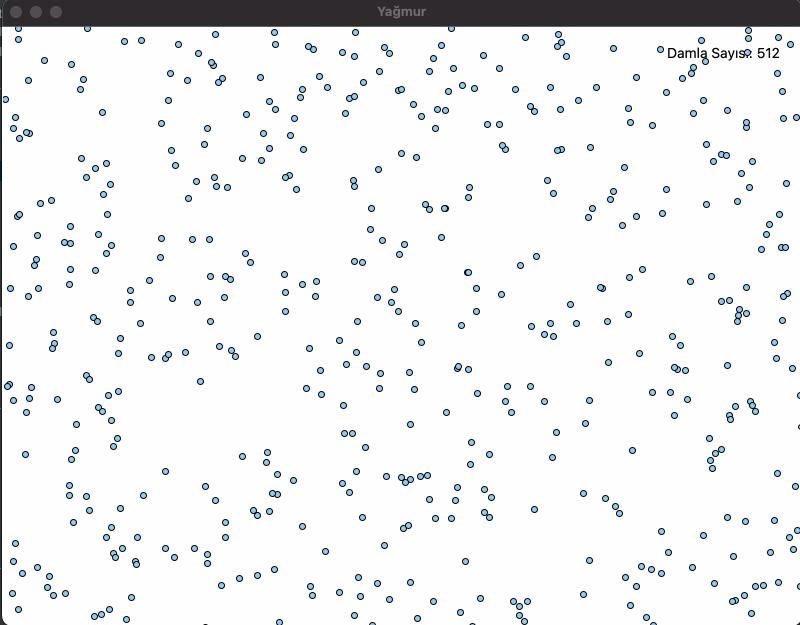

## Başlangıç Kodları
[Buraya tıklayarak](https://drive.google.com/file/d/1dSdFtl-Q_5KTEy49anBf1g8HEqyzHUCF/view?usp=sharing) problemlere ait başlangıç kodlarına ulaşabilirsiniz.

## Grup Çalışması - Hafta 5

## Egzersiz 1

Kasiyer Selin Hanım müşterilerin aldıkları ürünlerin fiyatlarının toplamını bulmak istiyor. Ona yardımcı olmak için bir program hazırlayalım. Selin Hanım girdi olarak 0 girene kadar ürünlerin fiyatları toplanmaya devam etmelidir.

```
# Örnek Çalışma Şekli

Merhabalar, toplam fiyatı öğrenmek için fiyatları girmeye başlayabilirsiniz!
> Ürün fiyatı giriniz: 5
> Ürün fiyatı giriniz: 10
> Ürün fiyatı giriniz: 14.5
> Ürün fiyatı giriniz: 3.75
> Ürün fiyatı giriniz: 0
Toplam fiyat: 33.25

```


### Egzersiz 2

Bu egzersizde sonsuza kadar devam eden bir yağmur animasyonu oluşturacağız.



Birçok parçadan oluşan bu görevi en kolay şekilde tamamlayabilmeniz için birkaç aşamaya ayırdık.


#### Aşama 1: Tek bir damlanın animasyonu

Animasyonumuzu yapmaya en küçük parçadan başlayacağız. 
`kanvas` üzerinde bir damla oluşturmak için sizin için tanımladığımız `damla_olustur` fonksiyonunu kullanabilirsin.
Bu fonksiyon kanvasın en üstünde ve rastgele bir x koordinatında bir damla objesi döndürüyor.

Derste yaptığımız *Zıplayan Top* egzersizine benzer şekilde yağmur damlamızın animasyonunun mümkün olduğunca gerçekçi olmasını istiyoruz.
Bu yüzden damlalarımız `MIN_BASLANGIC_HIZ` ila `MAX_BASLANGIC_HIZ` aralığında rastgele bir hızla başlayıp `YER_CEKIMI` etkisiyle her karede daha da hızlanmalı.


#### Aşama 2: Damlaların oluşumu

Dersteki zıplayan top egzersizinden farklı olarak damlalarımız sürekli kanvas içerisinde kalmıyor.
Bu yüzden sonsuz bir animasyon oluşturmak istiyorsak yeni damlaların oluşumu sürecini de sonsuza kadar sürdürmeliyiz.
Animasyonumuzun her bir karesinde `MIN_YENI_DAMLA` ila `MAX_YENI_DAMLA` aralığında rastgele sayıda yeni damla oluşturup bunları da animasyona dahil etmeliyiz.

**İpucu**: Damlaları bir listede tutabilirsin.

#### Aşama 3: Kanvası terkeden damlaları yok etmek

Animasyonunuz çalıştıkça yavaşladığını fark etmişsinizdir. 
Hatta yeterince açık bırakırsan animasyonunun bilgisayarının tüm hafızasını doldurarak programının kapanmasına neden olduğunu görebilirsin.
Bunun sebebi ekran dışına çıkmış olan damlaları da hala hafızamızda (listemizde) tutuyor olmamız ve bunları da hala hareket ettirmemiz.
Ekranın tamamen dışına çıkmış damlaları listeden çıkararak bu sorunu çözebiliriz.

**İpucu**: listelerin `pop` fonksiyonunu kullanarak belirli bir indekste bulunan elemanı listeden çıkarabilirsin. 
Örneğin `liste.pop(3)` 3. indeksteki elemanı listeden çıkarır.

#### Aşama 4: Ekrandaki damla sayısını gösteren bir yazı eklemek

Son olarak ekrandaki damla sayısını takip etmemizi sağlayan bir yazı oluşturmalıyız.
Yazının fontu ve koordinatları için `YAZI_X`, `YAZI_Y`, `FONT` ve `FONT_BUYUKLUGU` değişkenlerini kullanabilirsin.