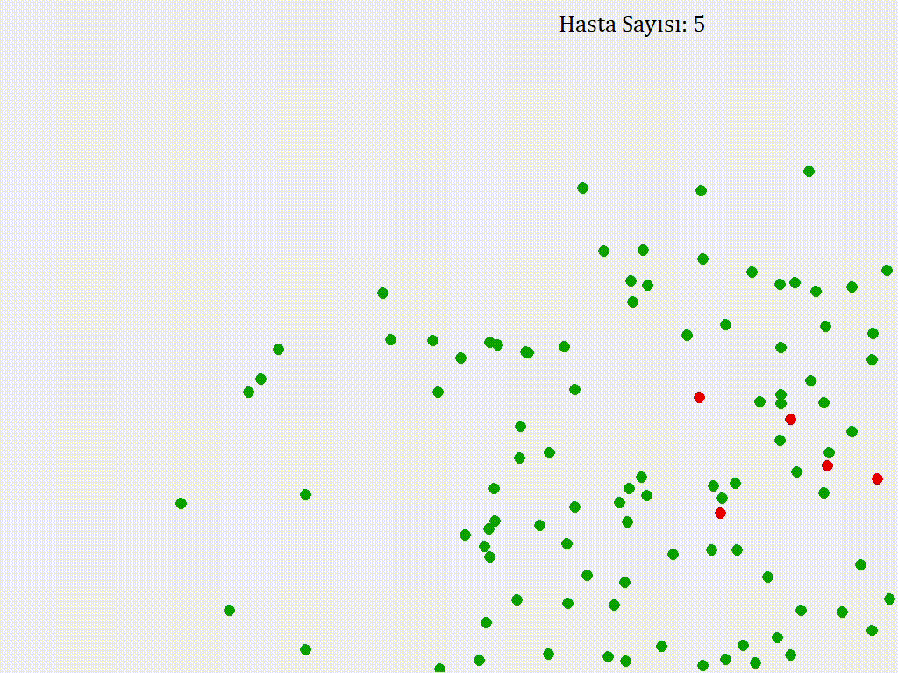
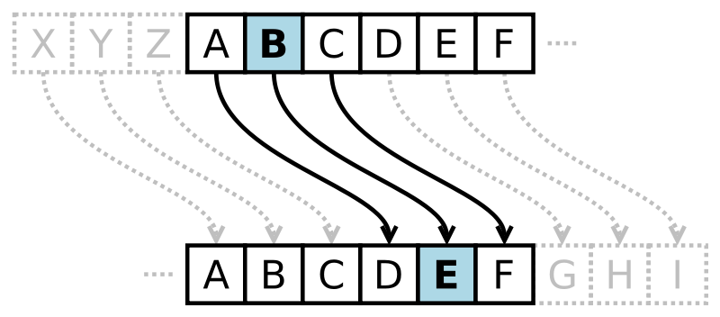
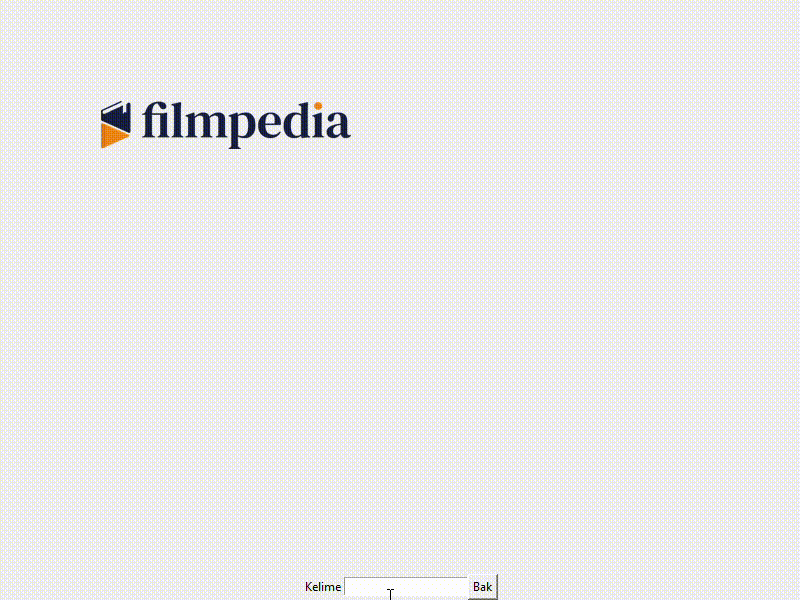

## Başlangıç Kodları

[Buraya tıklayarak](https://drive.google.com/file/d/1uLWfRaJsG6yEXKs8fHYpOEAT4M3TIIFH/view?usp=sharing) problemlere ait başlangıç kodlarına ulaşabilirsiniz.


## Egzersiz 1

Bu egzersiz bir bulaşma simulasyonudur. Kanvas üzerinde, rastgele hızlarla, rastgele yönlere doğru hareket eden
ve herhangi bir kenara çarptığında sekerek ekranda kalmaya devam eden 100 yeşil (sağlıklı) topun aynı özelliklere
sahip 1 kırmızı top tarafından temas durumunda hasta olmasını sağlamalıyız.

Topların isimleri bir sözlük içerisinde key olarak depo edilmeli. Her bir top için 3 elemanlı bir liste, (```hiz_x```, ```hiz_y``` ve hasta mı değil mi bilgisini içeren (```True```/```False```)), value olarak saklanmalı.

Unutmayın hasta olan her top bir başka topu da hasta etmeli. Canvas sınıfına ait, ```find_overlapping()``` fonksiyonu oldukça iş görebilir.



Önce Sözlük tanımlayarak başlayabiliriz. ```insanlar = {}```

ÖRNEK:
```insanlar = {top1:[hiz_x, hiz_y, True], top2:[hiz_x, hiz_y, False], ... top101::[hiz_x, hiz_y, False]}```

AŞAMA 1 - Hasta topu ekleme:
```create_oval()``` fonksiyonu ile ekranda istenilen bölgeye eklenebilecek bir oval daha sonra ```set_color()``` ile kırmızıya boyanabilir.
```random``` kütüphanesini kullanarak iki farklı sayı seçip hız değerleri şeklinde kaydedip, sözlüğe ilgili şekilde ekleyebiliriz.
Tabiki hasta top olduğu için True değerini de eklemeyi unutmayalım.

AŞAMA 2 - Sağlıklı topları ekleme:
Hasta topu eklemekle aynı, ancak bu sefer sayının biraz fazla olması gerek. (İpucu: for döngüsü güzel bir seçenek gibi duruyor).
Ha bir de bu toplar hasta değil ve kırmızı olmamalı.

AŞAMA 3 - Hareket ettirme:
Hareket ettirme (```hareket_ettir(insanlar)```) fonksiyonu sürekli çalışmalı, mesela bir döngünün içinde olması çok iyi olur. Ve döngü her döndüğünde 1 saniye durduğunu varsayın. Bu bir saniyede dictionary içerisinde hasta olan her top için ```find_overlapping()``` fonksiyonunu kullanarak hasta olmayanlarla kesişip kesişmediğini görebiliriz değil mi? (```kesisim_bul()```)

AŞAMA 4 - Kırmızıya çevirme:
Kırmızı ile kesişimi bulunan her bir yeşil ovali, yine ```kesisim_bul()``` fonksiyonu içerisinde kırmızıya çevirebiliriz.
Tabii ki rengi değişen oval artık False değeri taşımamalı.

AŞAMA 5 - Sayma:
```kac_hasta()``` fonksiyonu tam olarak bunu yapıyor. Önce belirlediği ```hasta_sayisi = 0``` değişkenini,
sözlük içerisinde True ifadesi taşıyan her bir oval için 1 arttırıp, hasta_sayisi değişkenini
döndürüyor. (```return```)

AŞAMA 6 - Bitirme:
Eğer herkes hasta olduysa programı durdurmalıyız.


## Egzersiz 2

Sanal bir toptan mağazanın sipariş işlerini düzenlemek için bir program yazalım.
Depodaki ürünlerimizin adı ve miktarları depo isimli dictionary veri tipinde tutulmaktadır.
Depodaki herhangi bir ürün bittiği zaman günlük satış hedefimize ulaşıyoruz ve mağazayı kapatıyoruz.
Depodaki bütün ürünler doluyken, ürünlerden biri bitene kadar kullanıcıdan sipariş almamız gerekiyor.
Depodaki ürünlerin dolu olup olmadığını kontrol etmek için `depo_dolu_mu(dict)` fonksiyonunu dolduralım ve kullanalım.
Sipariş almak için öncelikle kullanıcıdan almak istediği ürünün adını alalım, sonra eğer ürün depomuzda varsa
kullanıcıdan almak istediği miktarı öğrenelim. Eğer ürün yoksa, müşteriye o üründen satmadığımızı belirtelim 
ve elimizde olan ürünleri listeleyelim.
Eğer depomuzda o üründen istenilen miktarda bulunuyorsa o kadar ürünün teslimatını yapalım ve
depodaki ürün sayısını güncelleyelim. Eğer istenilen miktardan daha az ürün kaldıysa
müşteriyi bu konuda bilgilendirelim ve elimizde olan miktarda ürün satalım.
Her satıştan sonra müşteriye satışın ne kadar tuttuğunu söyleyelim.
Ürünlerin fiyatları urun_fiyatları isimli dictionary veri tipinde tutulmaktadır.
Her satışın sonunda depodaki ürünlerimizi ve sayılarını konsolda gösterelim, bunun için
`depodaki_urunleri_goster(dict)` fonksiyonunu kullanabiliriz.

```
Örnek Çalışma Biçimi #1:
> Hangi ürünü almak istersiniz? Pantolon
> Kaç tane istersiniz? 25
Elimizde 25 tane Pantolon kalmamış, size 20 tane veriyorum.
Alışverişinizin toplam tutarı: 500 TL.
Elimizdeki ürünler:
Pantolon -> 0 adet
T-shirt -> 30 adet
Gömlek -> 20 adet
Şort -> 25 adet
Ürünler bitti, herkese iyi akşamlar.


Örnek Çalışma Biçimi #2
> Hangi ürünü almak istersiniz? Hırka
Bizim mağazamızda Hırka satılmıyor.
Elimizdeki ürünler:
Pantolon -> 20 adet
T-shirt -> 30 adet
Gömlek -> 20 adet
Şort -> 25 adet
> Hangi ürünü almak istersiniz? Şort
> Kaç tane istersiniz? 25
Alışverişinizin toplam tutarı: 500 TL.
Elimizdeki ürünler:
Pantolon -> 20 adet
T-shirt -> 30 adet
Gömlek -> 20 adet
Şort -> 0 adet
Ürünler bitti, herkese iyi akşamlar.
```

## Bonus

### Egzersiz 1

Sezar Şifreleme

İsmini Romalı lider Jül Sezar’dan alınan bu şifreleme tekniği en çok bilinen ve en basit şifreleme methodlarından bir tanesidir. Basit olarak alfabedeki her bir harfi belirli sayıda ilerideki harfe atama prensibinden oluşur. 


Örnek bir Sezar şifrelemesi


Sizden istediğimiz, dictionary veri tipi kullanarak alfabedeki her bir harfi kullanıcıdan alacağınız sayı kadar sonraki harfe atamanız ve sonrasıdan kullanıcıdan bir mesaj alıp bunu şifrelemeniz. 

Örnek Çalışma:
```
> Bir sayı girin: 3
> Şifrelenecek mesajı girin: merhaba dünya
Şifrelenmiş mesaj: öğtjçdç gzpbç
```

## Egzerisz 2

Filmpedia

Önceden verilen iki sözlüğün içersindeki bilgileri kullanarak:
    - İsmi verilen filmin aktörlerini ve filmin kapak fotoğrafını
    - İsmi verilen aktörün oynadığı filmleri ve aktörün fotoğrafını
gösteren 'Filmpedia' adında arayüz oluşturmalıyız.

Ekranın alt kısmında bir arama çubuğu ve butonu olmalı. Butona her basıldığında
kutuya yazılan metni iki sözlüğün içerisinde de aramalı ve sonucu:
    - Sol üstte logo
    - Sağda görsel
    - Solda ortada içerik
şeklinde ekrana yansıtmalı



AŞAMA 1 - Başlangıc Arayüzünü Oluşturma:

Sol üstte görünecek logo'yu create_image_with_size() fonskiyonu ve verilen
global değişkenler ile oluşturduktan sonra, alt kısma bir input kutucuğu ve "Bak"
butonu ekleyelim.

"Bak" butonun çalışması ve ```yansıt(buton_ismi)``` fonksiyonunu çağırması için:
```set_on_button_clicked(yansit)``` komutunu kullanabiliriz.

Ekranın kapanmaması da gerek: ```wait_for_click()```

AŞAMA 2 - Bilgileri yansıtma:

Öncelikle, ```yansit()``` fonksiyonu her çalıştığında ekranı temizleyip, logoyu tekrar
eklemeli ki "Bak" butonu sonsuz kere tıklansa dahi sorun çıkarmadan çalışabilsin.

Not: ```get_text_field_text()``` -> daha önceden oluşturulmuş, adı verilen metin kutucuğunun
içerisinde yazılmış olan metni'i alıp döndürür.

Bu sayede, kutucuğa yazdığımız şeyi sözlüklerimizde arayabiliriz.

AŞAMA 3 - Görsel Ekleme:

Aşama 2'deki yöntemle sahip olduğumuz bu kelimeyi;
    
    ```dosya_adi = "resimler\\" + kelime + ".png"```

şeklinde kullanarak, görüntüleyeceğimiz görselin lokasyonunu belirlemeliyiz.

Hemen ardından ```create_text()``` ve ```create_image()``` fonksiyonları ile
 
    "X, şu filmlerde oynadı:" VEYA "X filmde şu aktörler oynadı:"

şeklinde bir yazı gösterdikten sonra ilgili görseli sağda konumlandırabiliriz.

Hemen ardından, ilgili sözlükte verilen kelimeye bağlı listenin elemanlarını dizmek için,
```BASLIK_Y``` değişkenini başka bir değişkene kopyalayıp, her bir elemanı ekrana eklerken o değişkeni 25
arttırırsak ve o şekilde kullanırsak, sıralamamız gereken aktör veya filmleri düzgün bir şekilde
görüntüleyebiliriz. Her defasında 25 artan ```y``` koordinatı, yazdıklarımızı her defasında 25 piksel aşağıda
görüntüleyecektir.

Bu süreçte ihtiyac duyulan tüm koordinat bilgileri global değişken olarak önceden sağlanmıştır.


