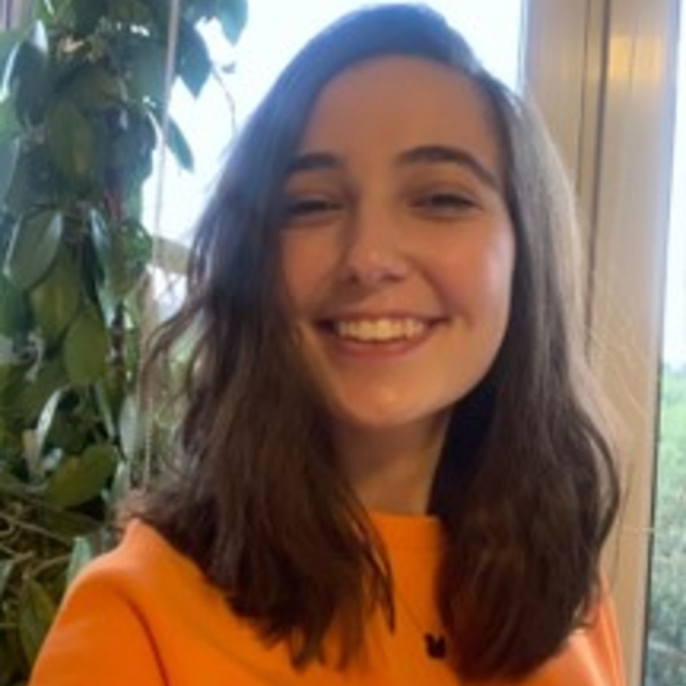

## CS 101: Merhaba, Dünya!

_CS 101: Merhaba, dünya!_ Türkiye'deki lise öğrencileri arasında programlama eğitimini ve takip eden profesyonel, teknik, sosyal ve kişisel becerileri teşvik etmek için dizayn edilmiş, Koç Üniversitesi öğrencileri tarafından organize edilen, 8 haftalık online bir programdır. CS 101 genel kanının aksine programlama eğitiminin kişilerin yatkın olduğu alanlardan bağımsız olarak problem çözme, yaratıcı ve analitik düşünme becerilerine katkısı olduğuna inanır, öğrencilerinin bu alanlardaki özgüvenlerini artırmayı hedefler.

CS 101 materyalleri programa katılan öğrencilerin çok az ya da hiç programlama bilmediği, Python'a aşina olmadığı varsayımı ile hazırlanmıştır.

Şu an için önceden belirlenmiş liselerle işbirliği içinde yürütülen programın gün geçtikçe daha çok öğrenci ve eğitmene ulaşması en büyük hayalimizdir.

Programın işleyişi, konular ve lojistik bilgiler için [Müfredat](/mufredat/)'ı inceleyebilirsiniz.
<!---->
## Programın Amacı

- Herkes için güvenli, eğlenceli ve verimli bir öğrenme ve öğretme ortamı oluşturmak.
- Öğrencilere ilgi alanlarında kullanabilecekleri ve program boyunca kazandıkları becerileri kendi başlarına ilerletebilecekleri pratik becerileri kazandırmak.
- Öğrencilerin fen, teknoloji, mühendislik ve matematik (STEM) alanlarındaki ilgilerini desteklemek.
- Fen, teknoloji, mühendislik ve matematik alanında cinsiyet eşitliğine katkıda bulunmak.
- Kaliteli ve açık kaynaklı Türkçe programlamaya giriş içeriklerine katkıda bulunmak.
- Hepsi üniversite öğrencisi olan eğitmenlere akranlarıyla işbirliği içinde ders vermek, materyal hazırlamak gibi deneyimleri kazanarak öğretim becerilerini geliştirebilecekleri bir ortam sunmak.

## Eğitmenler

<!-- may refactor this bit to a more About like page -->

CS 101 ekibi, bilgisayar bilimleri eğitimine gönül vermiş, akranlar arası öğretme ve öğrenmenin değerine inanan 11 üniversite öğrencisinden oluşur. Haftalık toplu dersleri canlı olarak dönüşümlü şekilde anlatan ekip üyeleri, materyallerin hazırlanmasında yer alır. Her eğitmen program başında kendisine atanan 12 <!-- todo: add exact number --> kişilik küçük gruplarla her hafta düzenli olarak 75 dakika toplanır. CS 101 eğitmenlerimizle tanışın:

<!-- Course Staff -->
<table>
<tr>
        <th>
                
                

                        <b>Gül Sena Altıntaş</b>
                

        </th>
        <th>
                
                

                        <b>Necla Mutlu</b>
                

        </th>
        <th>
                
                

                        <b>Ahmet Uysal</b>
                

        </th>
        <th>
                
                

                        <b>Ahmet Uyar</b>
                

        </th>
        </tr>
        <tr>       
        <th>
                
                

                        <b>Demet Tümkaya</b>
                

        </th>
        <th>
                
                

                        <b>Fırat Tamur</b>
                

        </th>
        <th>
                
                

                        <b>Hasan Can Aslan</b>
                

        </th>
        <th>
                
                

                        <b>İdil Defne Çekin</b>
                

        </th>
        </tr>
        <tr>
        <th>
                
                

                        <b>Oya Suran</b>
                

        </th>
        <th>
                
                

                        <b>Özgün Ozan Nacitarhan</b>
                

        </th>
        <th>
                
                

                        <b>Yekta Kocaoğullar</b>
                

        </th>
</tr>
</table>
<!-- 
 Ahmet Uyar | Gül Sena Altıntaş  | Oya Suran   
 Ahmet Uysal | Hasan Can Aslan  | Yekta Kocaoğullar   
 Demet Tümkaya | İdil Defne Çekin  | Ö. Ozan Nacitarhan   
 Fırat Tamur | Necla Mutlu 
{: style="color:gray; font-size: 120%; text-align: center; border:0px;"} -->

<!-- todo: add işbirlikçilerimiz, okullar, danışmanlar -->
<!-- ## İşbirlikçilerimiz -->